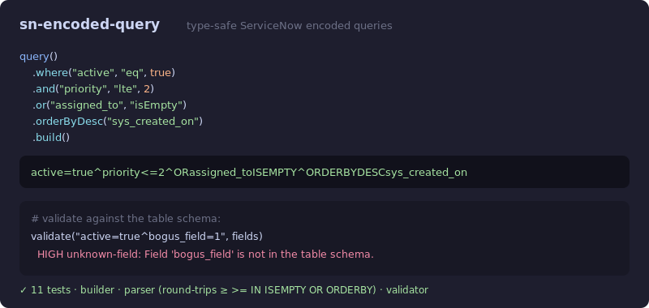

# sn-encoded-query

[](https://github.com/JCreatesGH/sn-encoded-query/actions)
[](https://www.typescriptlang.org/)
[](LICENSE)

Build, parse, **explain**, and validate ServiceNow **encoded queries** with a typed fluent API — no more hand-concatenating `active=true^priority<=2^ORDERBYDESC...` strings and hoping the operators are right, and no more squinting at someone else's query to figure out what it *means*.



## Install

```bash
npm install sn-encoded-query
```

## Build

```ts
import { query } from "sn-encoded-query";

query()
  .where("active", "eq", true)
  .and("priority", "lte", 2)
  .where("sys_created_on", "between", ["2026-01-01", "2026-12-31"])
  .or("assigned_to", "isEmpty")
  .orderByDesc("sys_created_on")
  .build();
// "active=true^priority<=2^sys_created_onBETWEEN2026-01-01@2026-12-31^ORassigned_toISEMPTY^ORDERBYDESCsys_created_on"
```

Operators are a typed union: `eq, ne, gt, lt, gte, lte, contains, notContains, startsWith, endsWith, in, notIn, between, isEmpty, isNotEmpty`. Unary, list (`IN`), and range (`BETWEEN`, encoded `low@high`) operators are handled correctly.

## Explain

Turn a cryptic query into a sentence — `humanize()`, or `--explain` on the CLI:

```ts
import { humanize } from "sn-encoded-query";

humanize("active=true^priority<=2^ORstate=1^ORDERBYDESCsys_created_on");
// "active is true and priority ≤ 2 or state is 1, sorted by sys_created_on (descending)"
```

## Parse & validate

```ts
import { parseQuery, validate } from "sn-encoded-query";

parseQuery("active=true^priority>=2^ORstate=6");   // structured conditions

validate("active=true^bogus_field=1", new Set(["active", "priority"]));
// [{ severity: "high", rule: "unknown-field", message: "Field 'bogus_field' is not in the table schema." }]
```

The validator catches unknown fields (when given a schema), unparseable operators, and empty `field=` values that should be `isEmpty` checks. The parser binds each condition to the **earliest** operator, so a value that contains operator text (e.g. `state=INPROGRESS`, `descriptionLIKEa=b`) parses correctly instead of splitting on the `IN`/`=` inside the value.

## CLI

Installing the package adds an `sn-encoded-query` command — parse and validate a query string (exits 1 on a HIGH issue):

```bash
$ sn-encoded-query "active=true^priority>=2^ORstate=6"
$ sn-encoded-query "state=INPROGRESS^assigned_toISEMPTY" --json
$ sn-encoded-query "active=true^priority<=2^ORDERBYDESCsys_created_on" --explain
  active is true and priority ≤ 2, sorted by sys_created_on (descending)
```

## Development

```bash
npm install && npm test    # 23 tests
npm run build              # tsc, clean
```

## License

MIT
